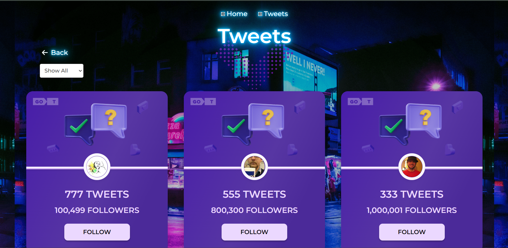

# TWEETS-APP

Клієнтська частина проекту "Tweets-app", яка надає інтерфейс користувача для
перегляду, слідкуваняя та фільтрування твітів. / The client part of the
Tweets-app project, which provides a user interface for viewing, tracking and
filtering tweets. 

## Реалізований функціонал / Implemented functionality

- [x] Базовий дизайн та функціонал сторінок. / Basic design and functionality of
      the pages.
- [x] Верстка фіксована в рх, семантична та валідна. / Layout is fixed in px,
      semantic and valid.
- [x] Інтерактивність працює відповідно до технічного завдання. / Interactivity
      works in accordance with the terms of reference.
- [x] Код відформатований та без коментарів. / Code formatted and without
      comments.
- [x] Немає помилок в консолі браузера. / No errors in browser console.
- [x] Створена маршрутизація через React Router. /Generated routing via React
      Router.
- [x] Додана фільтрація. /Added filtering.

## Технічний стек / Technical stack

## Встановлення та запуск / Get it up and running

1. Переконайтеся, що на вашому комп'ютері встановлені Node.js та npm. / Make
   sure you have Node.js and npm installed on your computer.
2. Встановіть залежності проекту командою `npm install` / Install the project
   dependencies with the command `npm install`.
3. Запустіть клієнтську частину за допомогою команди `npm run dev` / Run the
   client side with the command `npm run dev`.
4. Відкрийте ваш веб-браузер і перейдіть за посиланням
   [http://localhost:5173/tweets-app](http://localhost:5173/tweets-app) для
   перегляду додатку. / Open your web browser and follow the link
   [http://localhost:5173/tweets-app](http://localhost:5173/tweets-app) to view
   the application.

